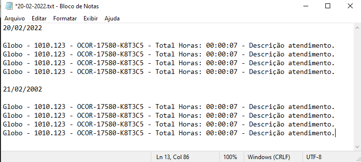

# Dynamics Hour Control

This Project is under CONSTRUCTION!

---

**Content**

* [About](#about)
* [Tecnology](#Tecnology)
* [Instalation](#Instalation) (Working progress)
* [How to use](#How-to-use)
* [Features & Roadmap](#Features)
    * [UI Experience](#UI-Experience)
    * [Support Functionalities](#Support-Functionalities)
    * [Project Functionalities](#Project-Functionalities)
    * [File Management](#File-Management)
* [Doubts](#Doubts)
---
# About

**Portuguese**

 Este aplicativo ajuda você a controlar as horas de trabalho em algum projeto.
Basta clicar no botão finalizar, o app salva em um arquivo texto os dados
você precisa fazer seus apontamentos, no final do dia.
 

**English**

This app helps you, to control the hours of you work in some project. 
Just click on the button finalize, the app save in a text file the data 
you need to do your appointments, at the end of the day.

---

# Tecnology

1. C# .NET
2. Windows Forms

---

# Instalation

Lorem Ipsum is simply dummy text of the printing and typesetting industry. 
Lorem Ipsum has been the industry's standard dummy text ever since the 1500s, 
when an unknown printer took a galley of type and scrambled it to make a type 
specimen book. It has survived not only five centuries, but also the leap into 
electronic typesetting, remaining essentially unchanged. It was popularised in 
the 1960s with the release of Letraset sheets containing Lorem Ipsum passages, 
and more recently with desktop publishing software like Aldus PageMaker including 
versions of Lorem Ipsum.

---

# How to use

1. Ao abrir o aplicativo ele vai selecionar a *Data* atual.
2. Preencher o campo *Empresa*.
3. Preencher o campo *Projeto*
4. Preencher o campo *Ocorrência*.
5. Marcar a *Check box* de Inicio, ao iniciar o atendimento.
6. Marcar a *Check box* de Fim, quando conluir o antedimento.
    * Conferir o tempo trabalhado, estando Ok clique em *Finalizar*.
    * Caso seja apenas uma pausa, ao retornar o atendimento desmarcar o *Fim*.
7. Ao clicar em *Finalizar*, o app vai salvar os dados do seu atendimento em um documento .TXT.

---

# Features

Veja abaixo o que temos planejado para melhorar o aplicativo.

# UI Experience

**Feito**

- [x] Se as Checkbox Inicio e Fim fores desmarcadas serão zeradas.
- [x] Ordenar a propriedade TabIndex das textBox.

**Fazer**
- [ ] Melhorar as cores do aplicativo.
    - [ ] Tema Dark.
    - [ ] Outros Temas.
- [ ] Organizar melhor so botões.
- [ ] Adicionar imagem da logo.

---

# Support Functionalities

**Feito**

- [x] Pega data atual (dia/mês/ano).
- [x] Check box inicio e fim do atendimento.
- [x] Cálculo de tempo gasto no atendimento.
- [x] Botão de conclusão do atendimento.
- [x] Criado 3 espaços para ocorrências.

**Fazer**

- [ ] Opção de selecionar data.
- [ ] Criar função que calcula a pausa.
- [ ] Replicar função do botão finalizar.
    
---

# Project Functionalities

---

# File Management

- [x] Cria pasta com nome da ocorrência.
    - [ ] Opção de ciar ou não pasta da ocorrência.
    - [ ] Opção de salvar pasta em outro lugar.
- [x] Ao finalizar, criar arquivo com dados do atendimento. 
    - [ ] Formatar os dados conforme imagem abaixo.
    
    - [ ] Criar arquivo cujo nome seja Ex: 20-02-2022 - Atendimentos.
    - [x] Salvar todos atendimentos do dia no mesmo arquivos.

---

# Doubts